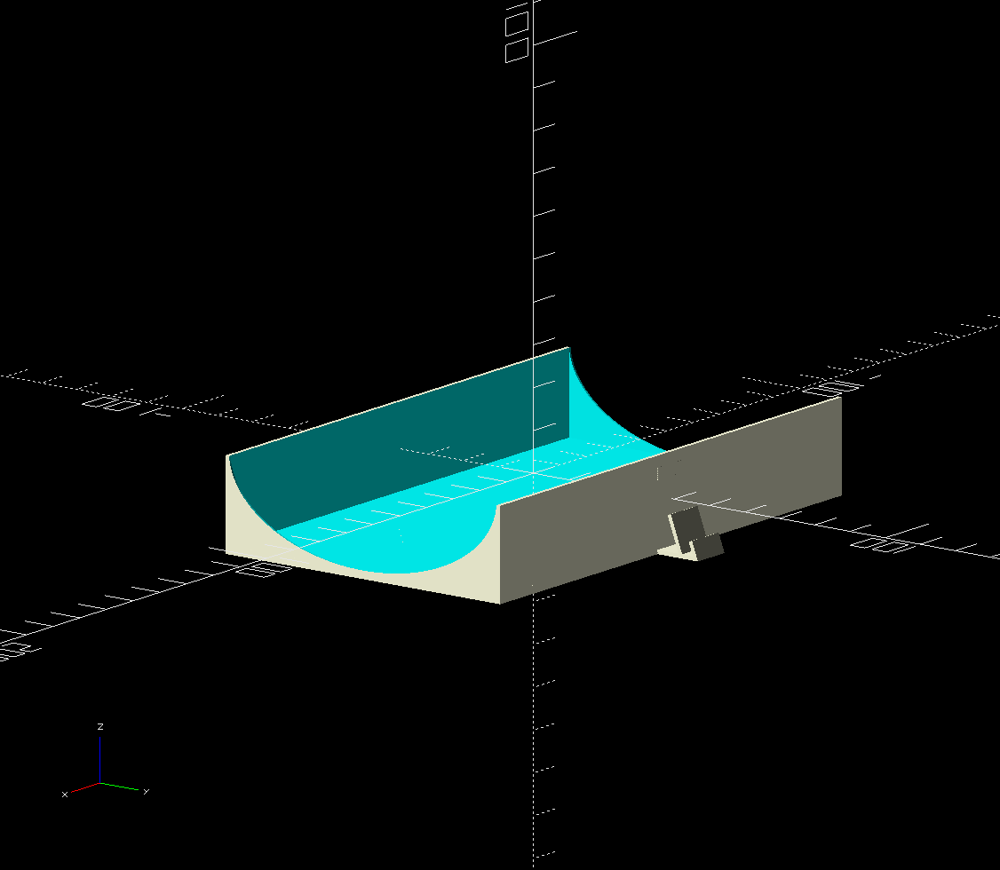
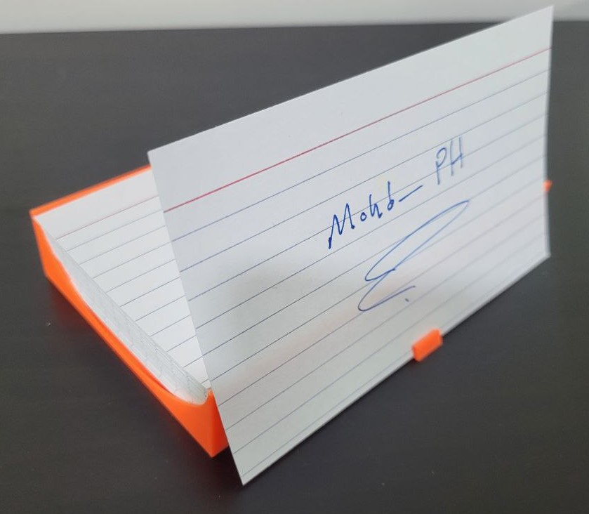

# parametric-3d-models

Repo for parametric 3D models in [OpenSCAD](https://openscad.org/)

Mainly used for 3D printing

# Models

## Notes display and holder

For office use

Add tolerance by increasing width and length as needed

Get in folder `notes-display-and-holder`

