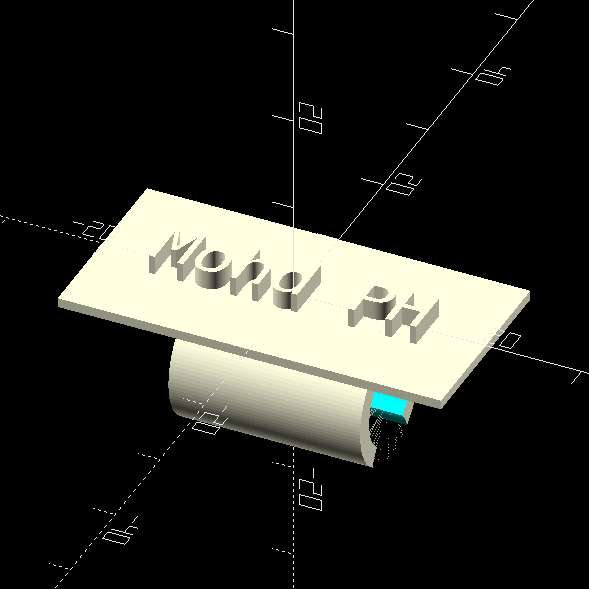
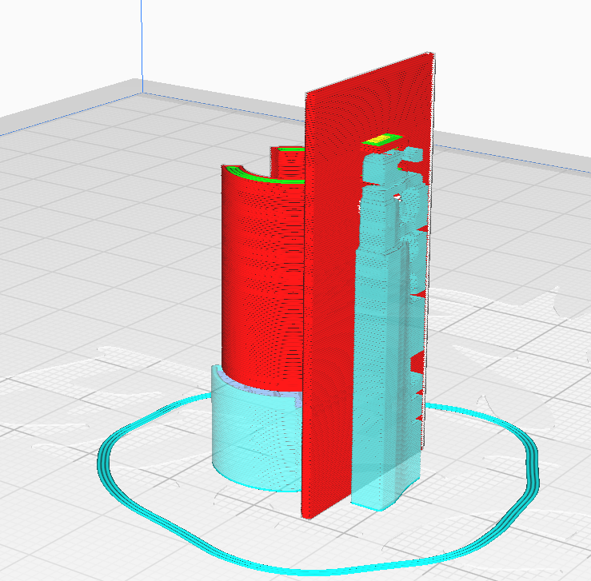
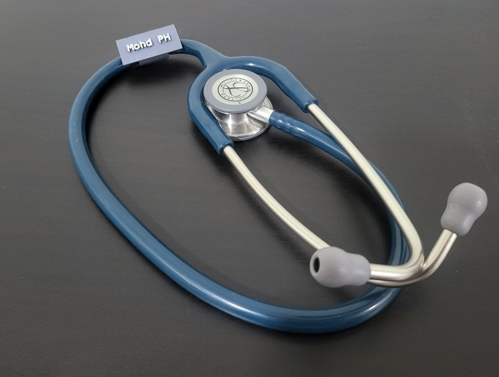

# parametric-3d-models

Repo for parametric 3D models in [OpenSCAD](https://openscad.org/)

Mainly used for 3D printing

# Models

## Notes display and holder

For office use

Add tolerance by increasing width and length as needed

Get in folder `notes-display-and-holder`

## Stethoscope clip

This is a stethoscope clipper or name tag

Possible improvements:

    - Two lines Text
    - Add ability to print logo, using SVG for example

Printing upright is recommended like the Cura screenshot

Get in folder `stethoscope-clip`

